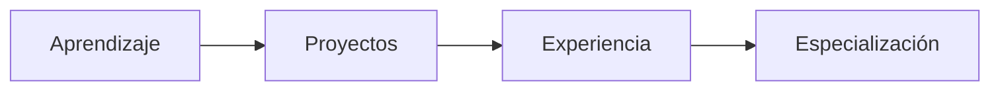

# 👋 Hola, soy Felipe  

🚀 **Desarrollador Fullstack en formación | Enfocado en soluciones empresariales reales**

---

## 🧑‍💻 Sobre mí  

💡 Me especializo en el desarrollo de software orientado a negocio, con enfoque en:  
- Automatización de procesos  
- Sistemas ERP  
- Soluciones escalables para PYMES  

🎯 Actualmente desarrollando:  
> 🏢 **Sistema ERP para automatización empresarial**

---

## 🧠 Filosofía de trabajo  

```txt
Problema real → Análisis → Solución eficiente → Escalabilidad
```

✔️ Desarrollo con propósito  
✔️ Código limpio y mantenible  
✔️ Pensamiento estructurado  
✔️ Enfoque en valor empresarial  

---

## ⚙️ Stack Tecnológico  

### 🚀 Frontend  


### 🔧 Backend  


### 🗄️ Base de Datos  


### 🔄 Herramientas  


---

## 📊 Proyecto Principal  

### 🏢 ERP para PYMES  

📌 Problema:  
- Procesos manuales  
- Errores en inventario  
- Ineficiencia operativa  

⚡ Solución:  
Sistema centralizado que automatiza:  
- Inventarios  
- Facturación  
- Gestión operativa  

🎯 Impacto esperado:  
- Reducción de errores  
- Mejora en la toma de decisiones  
- Optimización de recursos  

---

## 📈 En crecimiento  



---

## 🧩 Intereses  

- 🏢 Software empresarial  
- 🤖 Automatización  
- 🧠 Arquitectura de software  
- 📊 Análisis de sistemas  

---

## 📫 Contacto  

📌 GitHub: *(agrega tu perfil)*  
📌 LinkedIn: *(agrega tu perfil)*  

---

## ⚡ Estado actual  

🟢 En constante evolución  
🟢 Construyendo soluciones reales  
🟢 Enfocado en crecimiento profesional  

---

⭐ *Este perfil es una representación activa de mi progreso como desarrollador.*
